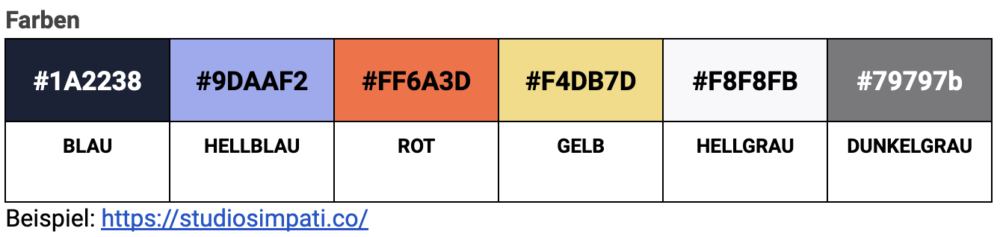

# Übung 7: Entwicklung eines Visitor Guides für das MD21

Manuel Fischer | 11. 12. 2022

# Zielsetzung

Für das "_ **Museum des 21. Jahrhunderts** **" (** **MD21** \_\_)_ soll ein Visitor Guide geschaffen werden. Der Visitor Guide stellt dabei den zentralen Kommunikationskanal des Museums mit den Buchser\*innen dar. Der Visitor Guide soll für die Allgemeinheit kostenlos über das Internet abrufbar sein. Der Visitor Guide stellt vertiefende Informationen zu ausgewählten Objekten, Sammlungen und Ausstellungen bereit. Die Informationen können in den gängigen Dateiformaten für Text, Bilder, Grafik,Video und Audio vorliegen.

## Leitgedanken

Für Design und Umsetzung des Visitor Guide gelten folgenden grundlegende Prinzipien:

1. **Mobile First:** Die Umsetzung muss zuallererst auf mobilen Endgeräten erfolgen und erst nachgelagert über stationäre Computer möglich sein.
2. **Design for all** : Grundlegende Designs richten sich auch und in besondere Weise an Menschen mit Behinderung, z.B sehbehinderte oder blinde Menschen
3. **Form follows Function** : Die "Funktion" steht im Vordergrund, das optische Erscheinungsbild unterstützt die angestrebte Funktion
4. **Customer Centricity** : Ein hoher Nutzen für die BesucherInnen sowie eine gesteigerte hedonische Qualität sind für den Erfolg des Visitor Guides von größter Bedeutung

## Anforderungen

- Der Visitor Guide (VG) ist auf Basis von Open Source Software entwickelt.
- Für den VG werden möglichst Standard Web-Formate verwendet (HTML, CSS, JavaScript)
- Die vertiefenden Informationen zu Ausstellungen, Sammlungen, Objekten sollte einfach aber möglichst umfangreich gehalten sein
- Der VG stellt den zentralen Kommunikationskanal des MD21 dar. Daher verfügt er neben vertiefenden Informationen zu den kulturellen Inhalten auch über folgendes: Impressum, Kontakt, AGB
- Der VG verfügt über die möglichkeit einzelne Objekte darzustellen, sowie Objekte im Kontext einer Ausstellung oder einer Sammlung
- Informationen zu Objekten, Ausstellungen, Sammlung können via Barcode abgerufen werden.
- Informationen zu Objekten, Ausstellungen und Sammlungen können über eine maximal fünfstellige Ziffernfolge abgerufen werden.
- Informationen zu Objekten, Ausstellungen und Sammlungen können als vollständige Liste ("alles anzeigen") sowie Liste der Kategorie (alle Objekte anzeigen, alle Ausstellungen anzeigen, alle Sammlungen anzeigen) angezeigt werden.
- Ist ein Objekt Teil einer Sammlung oder Ausstellung ist stets der Wechsel in die beinhaltende Sammlung / Ausstellung möglich
- Sammlungen können zahlreiche Objekte enthalten und Teil einer Ausstellung sein.
- Sammlungen können nicht in Sammlungen enthalten sein
- Ausstellungen können Sammlungen und Objekte enthalten. Ausstellungen können keine Ausstellungen enthalten und auch nicht Teil einer Sammlung sein.
- Informationen zu Objekten beginnen mit einem führenden O z.B: O7D3G
- Informationen zu Ausstellungen beginnen mit einem führenden A, z.B A12DF
- Informationen zu Sammlungen beginnen mit einem führenden S, z.B S78F3
- Zulässige Zeichen sind: [A-Z], [0-9].
- _Optional:_ Ein Angebot in einfacher Sprache (deutsch) sowie in Englisch ist wünschenswert

## Inhalte

Basis der Inhalte des MD21 sind:

_Europeana_

- [https://www.europeana.eu/de/collections/time/21-21st-century](https://www.europeana.eu/de/collections/time/21-21st-century)

_Museum für angewandte Kunst (MAK) in Wien:_

- [https://www.mak.at/](https://www.mak.at/)
- [https://artsandculture.google.com/partner/mak-austrian-museum-of-applied-arts](https://artsandculture.google.com/partner/mak-austrian-museum-of-applied-arts)

_Museum Europäischer Kulturen (MEK)_

- [https://www.smb.museum/museen-einrichtungen/museum-europaeischer-kulturen/home/](https://www.smb.museum/museen-einrichtungen/museum-europaeischer-kulturen/home/)
- [https://artsandculture.google.com/story/iQWxjmBpV_0rKQ](https://artsandculture.google.com/story/iQWxjmBpV_0rKQ)

**Konzeptphase**

Die Konzeption starten am Montag (12.12.2022)

**Projekt Zwischenstand**

Eine Projektzwischenstand ist am Sonntag (18.12.2022) abzugeben.

Der Projektzwischenstand umfasst:

- Click-Dummy
- Konzept
- Ersten Prototype
- Offene Punkte Liste

**Präsentation**

Die Präsentation des Zwischenstandes erfolgt am Montag (19.12) in der Zeit von 8 bis 12:00 Uhr.

#

# Fragen & Antworten

## Wofür steht MD?

MD steht für **M** useum **d** es … 21 Jahrhunderts

## Wie soll Design for all umgesetzt werden?

HTML Elementen nutzen für das, wofür sie gedacht wurden, Bspl.

- Tabellen dienen der Strukturierung von Daten nicht für optische Effekte wie abstand zwischen Textblöcken
- Überschriften (H1, H2, h3,...) dienen der inhaltlichen Gliederung von Text nicht der optischen Gestaltung
- Alt-Tags in Bildern verwenden
- Responsive Design z.B Textgröße auch sehr groß möglich
- Zoom-Button vorsehen
- Vorlesen durch "Automatik"
- gute Übersicht: [https://omr.com/de/reviews/contenthub/barrierefreies-webdesign](https://omr.com/de/reviews/contenthub/barrierefreies-webdesign)

Ferner sollten Inhalte in "_leichter" Sprache_ (=\> z.B für Menschen mit geistiger Behinderung oder Lernbehinderung) bzw. _einfacher Sprache_ (z.B. für Menschen, für die deutsch eine Fremdsprache ist) gehalten werden.

## Soll ein Corporate Identity genutzt werden?

### Farben

| **#1A2238** | **#9DAAF2**  | **#FF6A3D** | **#F4DB7D** | **#F8F8FB**  | **#79797b**    |
| ----------- | ------------ | ----------- | ----------- | ------------ | -------------- |
| **BLAU**    | **HELLBLAU** | **ROT**     | **GELB**    | **HELLGRAU** | **DUNKELGRAU** |

Beispiel: [https://studiosimpati.co/](https://studiosimpati.co/)

### Logo

|  |  |  |
| ------------------------------------------------------------- | ------------------------------------------------------------- | ------------------------------------------------------------- |

### Logo Download:

[https://drive.google.com/drive/folders/1Dhr8m5d7oCQeY8pXqEVqvebkX\_\_P8gqa?usp=share_link](https://drive.google.com/drive/folders/1Dhr8m5d7oCQeY8pXqEVqvebkX__P8gqa?usp=share_link)

### Fonts

- **Überschriften:** Montserrat, 48px, Medium 500, Kapitälchen, ([https://fonts.google.com/specimen/Montserrat](https://fonts.google.com/specimen/Montserrat))

- **Text:** Work Sans 16px,, Regular 400, [https://fonts.google.com/specimen/Work+Sans](https://fonts.google.com/specimen/Work+Sans)

# Ist die App nur innerhalb des Gebäudes verfügbar?

Die App ist von überall und zu jederzeit verfügbar

## Was ist unter Punkt 3 mit dem Begriff "nachgelagert" gemeint?

Unter "nachgelagert meint man Funktionen die wichtig aber nicht oberste Priorität haben sollten aber bedacht werden

## Worauf achtet man, wenn man eine hohe hedonische Qualität im VG erreichen möchte?

Es soll den NutzerInnen Spass machen die App zu verwenden

## Wie geht das mit Barcode auf Objekten setzen und lesen, müssen wir ein bestimmtes Protokoll dafür entwickeln? RFID-Protokoll etwas?

So einfach wie möglich. Die Standard-JS API nutzen

## Was heist: Farben werden bereitgestellt, bitte? Eine Farbpalette sollen wir als feature programmieren ??

Farbencodes, Farbpalette, die in der App verwendet werden sollten, werden als Farbcode in RGB(Hex) bereitgestellt. (=\> Adobe Color Wheel, Google Fonts)

## Werden Benutzerdaten erhoben?

Analytics ist derzeit nicht erforderlich, gerne optional.

## Sollen wir uns repräsentativ 10 Objekte aussuchen?

Die App sollte generisch für beliebig viele Objekte funktionieren. In der Entwicklung sollten für bestimmte Arten von Objekten Beispiele verwendet werden, zB:

- (Standard): Objekt mit Bild, Textbeschreibung ggf Video
- Ein Objekt mit Video
- Ein Objekt mit Audio
- Ein Objekt ohne Inhalte
- Ein Objekt mit sehr sehr ausführlicher Beschreibung
- Ein Objekt

# Vorgehen

1. Projektbeschreibung (dieser Text) sehr gründlich lesen
2. Fragen stellen
3. Datenmodell anlegen
4. visuelles Modell =\> z.B eine Zeichnung mit der Hand, Powerpoint oder Click-Dummy
5. Diskussion des UI Prototypen mit dem Kunden
6. Vision beschreiben =\> Epics =\> User Story =\> Task
7. Alle Anforderungen speichern wir in einem Backlog
8. Alle Anforderungen die jetzt gerade (im aktuellen Sprint) bearbeitet werden kommen in das Sprint Backlog
