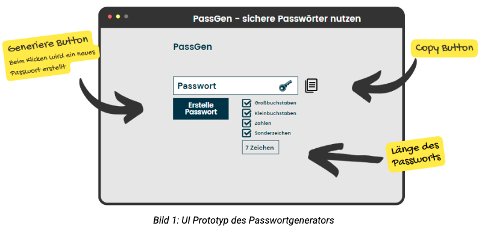

# Übung 6: Objektorientierte Programmierung mit JavaScript

## Manuel Fischer | 06. 12. 2022

### :one: Was versteht man unter Objektorientierung?

:white_check_mark:

---

### :two: Inwiefern ist der objektorientierte Ansatz in JavaScript ungewöhnlich?

## :white_check_mark:

### :three: Was versteht man unter den grundlegenden Konzepten der Objektorientierung?

## :white_check_mark:

### :four: Beschreibe folgende Begriffe in Stichworten

Abstraktion
Klasse
Methode
Objekt
Polymorphie
Prototyp
Property / Eigenschaft

:white_check_mark:
:white_check_mark:
:white_check_mark:
:white_check_mark:

---

### :five: Kochrezept

Definiere ein Objekt “Kochrezept” mit den Eigenschaften Zutaten, Schwierigkeitsgrad, Dauer sowie den Fähigkeiten mischen, zubereiten, anrichten

## :white_check_mark:

### :six: Passwortgenerator

Erstelle mittels objektorientierter Programmierung einen Passwortgenerator. Beachte dabei die gegebenen Anforderungen sowie nachfolgende Grafik

:bangbang: Anforderungen :bangbang:

- Beim Klicken auf den “generiere” Button wird ein neues Passwort erstellt
- Die Länge des Passworts kann über das Frontend vorgegeben werden.
- Bei der Initialisierung beträgt die Passwortlänge 7 Zeichen
- Ein Passwort besteht aus Großbuchstaben, Kleinbuchstaben, Zahlen und Sonderzeichen  
  :fire:[Herausforderung] Über das Frontend kann festgelegt werden, welche Art von Zeichen das Passwort enthält  
  :fire:[Herausforderung] Neben dem Ausgabefeld befindet sich ein “Copy” Button, sodass das neu generierte Passwort direkt in die Zwischenablage kopiert wird

